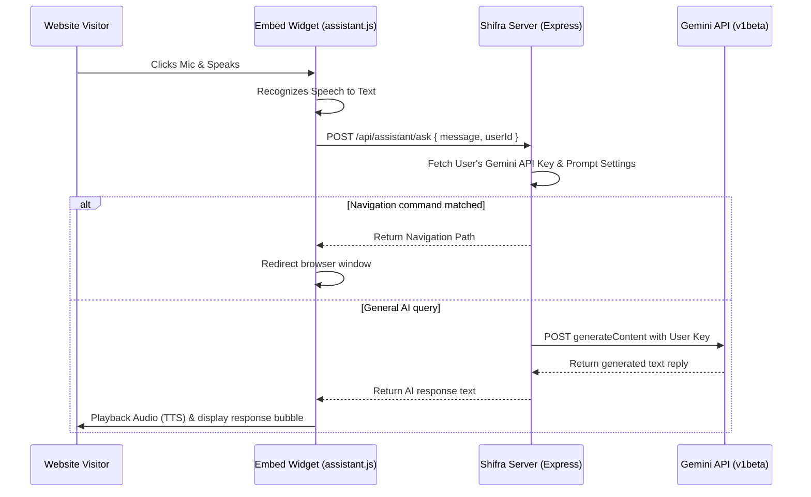

# 🎙️ Shifra AI – AI Voice Assistant Builder

<div align="center">

[](https://reactjs.org/)
[](https://nodejs.org/)
[](https://expressjs.com/)
[](https://www.mongodb.com/)
[](https://ai.google.dev/)
[](https://razorpay.com/)

**Add a smart, voice-enabled assistant to your website in seconds.**
*Speak naturally, navigate seamlessly, and engage visitors intelligently.*

</div>

---

## 📌 Project Description

**Shifra AI** is an advanced AI-powered voice assistant builder that allows website owners to create, customize, and embed a smart conversational assistant on their websites. By integrating Google's Web Speech API and Gemini LLMs, Shifra AI enables natural speech recognition, voice playback, and page navigation capabilities through simple conversational prompts.

Website owners can configure their assistant's identity, business context, response tone, and design theme via a visual dashboard, then embed it into their site by copying a single `<script>` tag.

---

## ✨ Features

- **🎙️ Real-time Speech-to-Text & Text-to-Speech:** Uses the browser's native `SpeechRecognition` and `SpeechSynthesis` interfaces for smooth, lag-free voice interaction.
- **🧠 Custom Gemini AI Integration:** Leverages the `gemini-2.5-flash` model using website owners' personal Gemini API keys.
- **⚙️ Visual Builder Dashboard:** Complete visual configuration dashboard to edit:
  - Assistant Name
  - Business Information (Name, Type, Description)
  - Tone of voice (`friendly`, `professional`, `sales`)
  - Theme styling (`light`, `dark`, `glass`, `neon`)
  - Gemini API key with **instant live validation testing**
- **🧭 Conversational Page Navigation:** Define site pages and keywords (e.g., "pricing", "/pricing"). The assistant automatically detects navigation intent and redirects the visitor.
- **📦 Embeddable Widget Script:** Copy a lightweight script tag to load the widget on any website.
- **💳 Monetization & Billing:** Integrated with Razorpay to allow upgrading to a premium (`pro`) plan, granting extended request limits.

---

## 🛠️ Tech Stack

### Frontend
- **Framework:** React 18+ (Vite)
- **Routing:** React Router DOM v6
- **Icons:** React Icons (`fi`, `ci`)
- **HTTP Client:** Axios
- **Notifications:** React Hot Toast

### Backend
- **Framework:** Node.js + Express.js (ES Modules)
- **Database Wrapper:** Mongoose (MongoDB Atlas)
- **Security & Session:** JSON Web Token (JWT) & Cookie Parser
- **CORS:** Configuration for credential-sharing between client and server

### Database
- **Provider:** MongoDB Atlas
- **Models:** User Schema, Billing Schema

### AI/LLM
- **Model:** Google Gemini API (`gemini-2.5-flash`)

### Payment / Subscription
- **Integration:** Razorpay SDK

---

## 📂 Folder Structure

```markdown
ShifraAI/
├── Client/                 # React frontend application
│   ├── public/             # Static public assets and widget script
│   │   ├── assistant.js    # Embeddable assistant widget logic
│   │   ├── assistant.css   # Widget themes and layout styles
│   │   ├── test-widget.html# Test page for widget integration
│   │   └── mic.svg         # Mic button asset
│   ├── src/
│   │   ├── Components/     # Reusable layout and preview components
│   │   ├── pages/          # Home, Login, Builder, Billing views
│   │   ├── App.jsx         # App router and authentication context
│   │   └── main.jsx        # App entry point
│   ├── .env                # Client environment config
│   └── package.json
├── Server/                 # Node/Express backend server
│   ├── Configs/            # DB connection, Gemini model, Razorpay configuration
│   ├── Controllers/        # Business logic for auth, billing, user, and assistant
│   ├── Middleware/         # JWT-based route protection
│   ├── Models/             # MongoDB schemas (User, Billing)
│   ├── Routes/             # API routes definition
│   ├── index.js            # Server entry point
│   ├── .env                # Server environment config
│   └── package.json
├── start-all.bat           # Helper script to run both client and server (Windows)
└── README.md               # Documentation
```

---

## 🔄 How It Works



---

## 📋 Prerequisites & Software Requirements

- **Node.js:** v18.0.0 or higher
- **Package Manager:** npm v9.0.0 or higher
- **MongoDB Database:** A local database instance or a MongoDB Atlas Cloud connection string
- **Gemini API Key:** A valid Google AI Studio developer API key

---

## ⚙️ Environment Variables

### Backend (`Server/.env`)
Create a file named `.env` inside the `Server/` directory:
```env
PORT=8000
MONGODB_URL=mongodb+srv://<username>:<password>@cluster0.mongodb.net/shifra
JWT_SECRET=your_jwt_secret_token_here
RAZORPAY_KEY_ID=rzp_test_your_key_id
RAZORPAY_KEY_SECRET=your_razorpay_secret_key
```

### Client (`Client/.env`)
Create a file named `.env` inside the `Client/` directory:
```env
VITE_FIREBASE_API_KEY=your_firebase_api_key
VITE_RAZORPAY_KEY_ID=rzp_test_your_key_id
```

---

## 🚀 Installation & Setup

### 1. Clone the Repository
```bash
git clone https://github.com/your-username/ShifraAI.git
cd ShifraAI
```

### 2. Start the Backend Server
```bash
cd Server
npm install
npm run dev
```

### 3. Start the Frontend Client
Open a second terminal window:
```bash
cd Client
npm install
npm run dev
```

---

## 🌐 API Endpoints

### Authentication Routes (`/api/auth`)
* **`POST /api/auth/google`** - Handles login and registers users via Google Account credentials. Sets a secure JWT cookie.
* **`GET /api/auth/logout`** - Clears the authentication session cookie.

### User/Builder Routes (`/api/user`)
* **`GET /api/user/current-user`** - Fetches the authenticated user profile details.
* **`POST /api/user/save-assistant`** - Validates the Gemini key and saves assistant configuration parameters.
* **`POST /api/user/test-key`** - Tests if the provided Gemini API key is valid by querying the listModels endpoint.

### Assistant Routes (`/api/assistant`)
* **`GET /api/assistant/config/:userId`** - Public route for the widget script to download assistant configuration (theme, tone, name) without revealing the API key.
* **`POST /api/assistant/ask`** - Processes speech queries, matches navigation intents, and routes prompts to Gemini.

### Billing Routes (`/api/billing`)
* **`POST /api/billing/order`** - Creates a payment order via Razorpay.
* **`POST /api/billing/verify`** - Verifies payment signature and upgrades user to the `pro` subscription plan.

---

## 🗃️ Database Schemas

### User Collection
```javascript
{
  name: { type: String, required: true },
  email: { type: String, required: true, unique: true },
  assistantName: { type: String, default: "Shifra" },
  businessName: { type: String, default: "" },
  businessType: { type: String, default: "" },
  businessDescription: { type: String, default: "" },
  tone: { type: String, enum: ["friendly", "professional", "sales"], default: "friendly" },
  theme: { type: String, enum: ["light", "dark", "glass", "neon"], default: "dark" },
  enableVoice: { type: Boolean, default: true },
  pages: [{ name: String, path: String, keywords: [String] }],
  enableNavigation: { type: Boolean, default: true },
  geminiApiKey: { type: String, default: "" },
  geminiStatus: { type: String, enum: ["active", "quota_exceeded", "invalid"], default: "active" },
  totalMessages: { type: Number, default: 0 },
  plan: { type: String, enum: ["free", "pro"], default: "free" },
  requestLimit: { type: Number, default: 200 },
  proExpiresAt: { type: Date, default: null },
  isSetupComplete: { type: Boolean, default: false }
}
```

### Billing Collection
```javascript
{
  userId: { type: mongoose.Schema.Types.ObjectId, ref: "User" },
  amount: Number,
  plan: String,
  paymentId: String,
  orderId: String,
  status: { type: String, enum: ["created", "paid", "failed"], default: "created" }
}
```

---

## 🔌 Embed Script Usage

To place the assistant on any external HTML website, add this script tag right before the closing `</body>` tag:

```html
<!-- Load the Shifra AI Voice Assistant -->
<script src="http://localhost:5173/assistant.js" data-user-id="YOUR_USER_ID"></script>
```

Replace `YOUR_USER_ID` with the unique user ID from your visual dashboard profile.

---

## 🔧 Troubleshooting & Common Errors

* **Error: `Invalid API Key. Please update your Gemini API key.`**
  * Check if your API key has been entered correctly in the Builder dashboard. Use the **Test Key** button to confirm validity.
  * Ensure the server can connect to `https://generativelanguage.googleapis.com`.
* **Speech Recognition Not Supported / Fails:**
  * Native browser `SpeechRecognition` requires user permissions and runs best in modern Chromium-based browsers (Chrome, Edge, Opera).
* **SameSite Cookie Warnings in Chrome / Login Fails:**
  * For local development, make sure `NODE_ENV` is not set to `production` in your `.env` so cookies use `SameSite: 'lax'` and no secure flags are enforced on non-HTTPS connections.

---

## 📄 License
This project is licensed under the MIT License.

---

## 👤 Author
**Riya Bisht**
* [GitHub Profile](https://github.com/RiyaBisht716)
